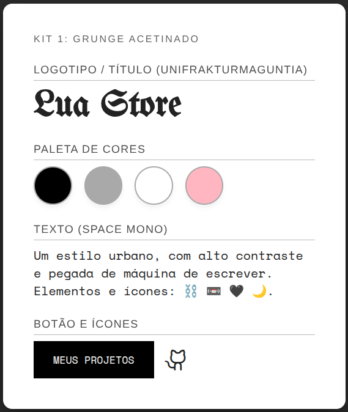
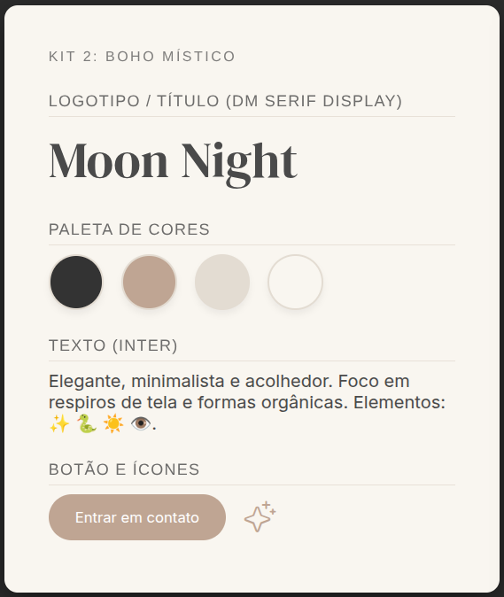
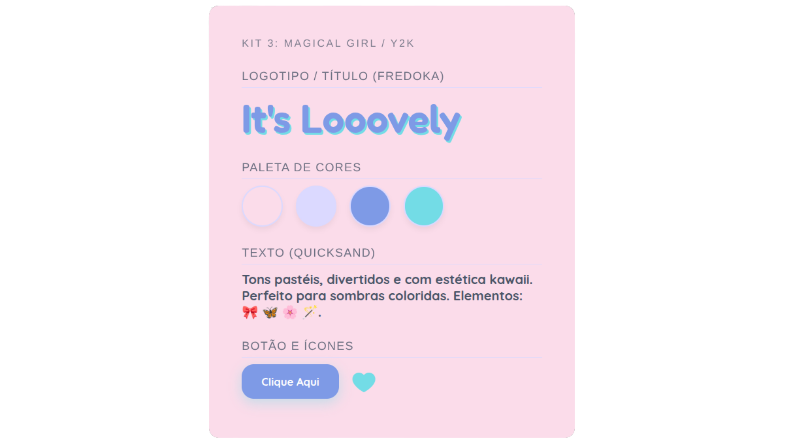
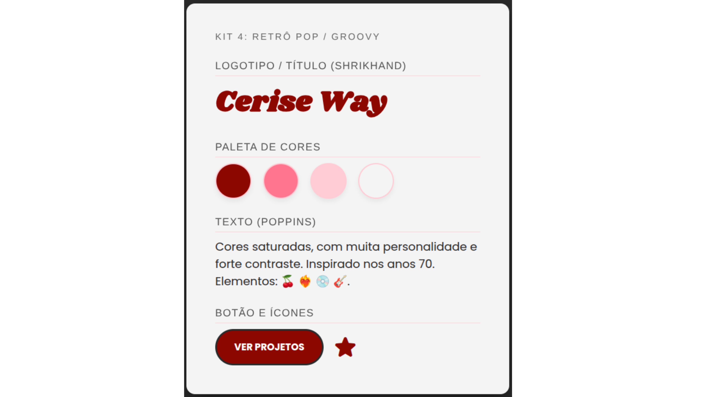

# 🎨 Kits de estilo
Boas-vindas à nossa galeria de estilos! Programar é incrível, mas colocar a sua personalidade no código é o que torna o projeto realmente seu.

Abaixo, cada kit já vem com as cores e as fontes combinando para você se inspirar e montar seu portfólio.

### 🛠️ Como usar?
Escolha o seu estilo favorito abaixo.

Copie o link das fontes e cole no seu arquivo index.html (dentro da tag `<head>`).

Por último, copie o bloco de cores e substitua o bloco :root que está no topo do seu arquivo style.css.


## 🖤 Kit 1: grunge acetinado

Alternativo, noturno, urbano e com muito contraste.

Fontes para colar no seu HTML:

```html
<link href="https://fonts.googleapis.com/css2?family=Space+Mono&family=UnifrakturMaguntia&display=swap" rel="stylesheet">
```

Variáveis para colar no seu CSS:

```css
:root {
    --bg-page: #ffffff; /* Fundo branco puro */
    --bg-card: #f5f5f5; /* Fundo dos cards cinza bem claro */
    --primary-color: #000000; /* Preto absoluto para destaque */
    --accent-color: #ffb6c1; /* Rosa claro pastel para detalhes */
    --text-main: #222222; /* Texto principal escuro */
    --border-color: #a9a9a9; /* Cinza médio para linhas e bordas */
}


/* Dica: Use 'UnifrakturMaguntia' para Títulos e 'Space Mono' para Textos! */
```

## 🌙 Kit 2: boho místico

Elegante, minimalista, acolhedor e maduro.

Fontes para colar no seu HTML:

```html
<link href="https://fonts.googleapis.com/css2?family=DM+Serif+Display&family=Inter&display=swap" rel="stylesheet">
```

Variáveis para colar no seu CSS:

```css
:root {
    --bg-page: #f9f6f0; /* Off-white/Bege clarinho elegante */
    --bg-card: #ffffff; /* Fundo dos cards branco */
    --primary-color: #333333; /* Chumbo (quase preto) para não cansar a vista */
    --accent-color: #bfa593; /* Nude/Marrom claro sofisticado */
    --text-main: #4a4a4a; /* Cinza escuro para os textos longos */
    --border-color: #e3dcd2; /* Bege mais escuro para bordas finas */
}

/* Dica: Use 'DM Serif Display' para Títulos e 'Inter' para Textos! */
```

## 🦋 Kit 3: magical girl

Pastel, vibrante, fofo, nostálgico e com a energia dos anos 2000.

Fontes para colar no seu HTML:

```html
<link href="https://fonts.googleapis.com/css2?family=Fredoka:wght@500&family=Quicksand:wght@500;700&display=swap" rel="stylesheet">
```

Variáveis para colar no seu CSS:

```css
:root {
    --bg-page: #fbdcea; /* Fundo rosa algodão doce */
    --bg-card: #ffffff; /* Fundo dos cards branco */
    --primary-color: #7e9ae6; /* Azul periwinkle (destaque principal) */
    --accent-color: #73dce6; /* Turquesa vibrante (detalhes mágicos) */
    --text-main: #4a5568; /* Azul marinho acinzentado para leitura */
    --border-color: #dbd9ff; /* Lilás clarinho para as bordas */
}

/* Dica: Use 'Fredoka' para Títulos e 'Quicksand' para Textos! */
```

## 🍒 Kit 4: retrô pop

Vibrante, quente, com atitude de sobra e inspirado nos anos 70.

Fontes para colar no seu HTML:

```html
<link href="https://fonts.googleapis.com/css2?family=Poppins&family=Shrikhand&display=swap" rel="stylesheet">
```

Variáveis para colar no seu CSS:

```css
:root {
    --bg-page: #f4f4f4; /* Cinza super claro para deixar o vermelho brilhar */
    --bg-card: #ffffff; /* Fundo dos cards branco */
    --primary-color: #8d0701; /* Vermelho cereja fechado */
    --accent-color: #ff758f; /* Rosa choque quente para dar contraste */
    --text-main: #2b2b2b; /* Preto suave para os textos */
    --border-color: #ffccd5; /* Rosa bem clarinho para detalhes */
}

/* Dica: Use 'Shrikhand' para Títulos e 'Poppins' para Textos! */
```

## 💡 Dica extra
Não gostou de nenhum e quer criar a sua própria paleta? Acesse o Coolors.co e aperte a barra de espaço até achar uma combinação de cores que seja a sua cara!